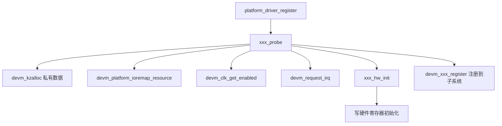

# {Case 标题} / walkthrough（probe 逐段解析）

## 整体调用图



## probe 函数关键段落

### 段 1：私有数据 & 资源拿取

```c
static int xxx_probe(struct platform_device *pdev)
{
    struct xxx_dev *xxx;
    int ret;

    xxx = devm_kzalloc(&pdev->dev, sizeof(*xxx), GFP_KERNEL);
    if (!xxx)
        return -ENOMEM;
    ...
}
```

**这段做了什么 / 为什么这么写**：
- {分析}

**踩坑点**：
- {如果 vendor 这里写得不对，会怎样}

### 段 2：寄存器映射

```c
xxx->base = devm_platform_ioremap_resource(pdev, 0);
if (IS_ERR(xxx->base))
    return PTR_ERR(xxx->base);
```

**这段做了什么 / 为什么这么写**：
- {分析}

### 段 3：时钟 / 电源 / pinctrl

```c
xxx->clk = devm_clk_get_enabled(&pdev->dev, "xxx");
if (IS_ERR(xxx->clk))
    return PTR_ERR(xxx->clk);
```

**这段做了什么 / 为什么这么写**：
- {分析}

### 段 4：中断注册

```c
ret = devm_request_irq(&pdev->dev, irq, xxx_irq_handler,
                       IRQF_SHARED, dev_name(&pdev->dev), xxx);
```

**这段做了什么 / 为什么这么写**：
- {分析}
- top-half 还是 threaded？为什么？

### 段 5：硬件初始化

```c
xxx_hw_init(xxx);
```

**这段做了什么 / 为什么这么写**：
- {一定要解释寄存器序列}

### 段 6：注册到子系统

```c
ret = devm_xxx_register(&pdev->dev, &xxx->subsys_dev);
```

**这段做了什么 / 为什么这么写**：
- {子系统提供了哪些用户态接口？}

## 错误路径分析

| 在第几段失败 | devm_* 自动释放了什么 | 还有什么要手动清理（应该没有） |
|-------------|---------------------|---------------------------|
| 段 1 失败 | (没分配) | - |
| 段 2 失败 | 段 1 内存 | - |
| 段 3 失败 | 段 1-2 | - |
| 段 4 失败 | 段 1-3 + clk disable_unprepare | - |
| 段 5 失败 | 段 1-4 + irq free | 硬件状态需 reset 吗？ |
| 段 6 失败 | 全部 | - |

## 我的惊讶点 / 第一次见的模式

- {例如：第一次见 `devm_clk_get_enabled`，原来 v6.0 之后可以一步搞定}
- {例如：`IRQF_SHARED` 在这里其实没必要}

## 1-2 道面试题

### Q: 为什么这里用 `devm_clk_get_enabled` 而不是 `devm_clk_get` + `clk_prepare_enable`？

{答案要点}

### Q: 段 5 失败时，硬件已经被部分初始化，为什么不需要 reset？

{答案要点}
