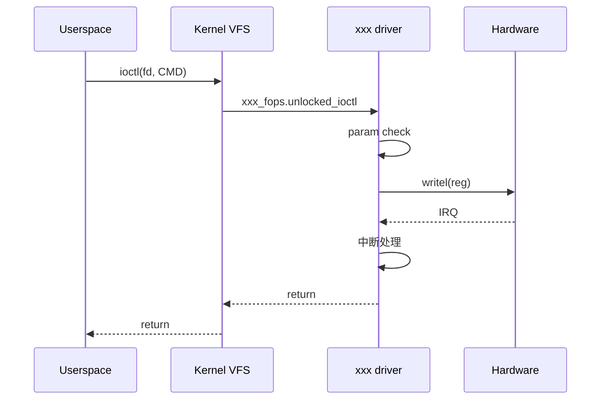

# {Case 标题} / trace（一次操作的完整调用栈）

## 选哪个操作

| 操作 | 入口 | 难度 |
|------|------|------|
| {例：i2c_master_send} | userspace `write(/dev/i2c-N)` | ★★ |
| ... | ... | ... |

本次追的：**{选定的操作}**

## 用户态触发

```c
// userspace 测试代码
int fd = open("/dev/xxx", O_RDWR);
ioctl(fd, XXX_DO_SOMETHING, &arg);
```

## 调用链全栈

```text
userspace: ioctl(fd, XXX_DO_SOMETHING, &arg)
  ↓ glibc 系统调用
sys_ioctl (fs/ioctl.c)
  ↓
vfs_ioctl
  ↓
xxx_fops.unlocked_ioctl  ← 这里跳进 driver
  ↓
xxx_do_something (drivers/.../xxx.c)
  ↓
xxx_hw_write_reg
  ↓
writel(val, base + OFFSET_XXX)  ← 真正写到硬件
```

## 用 ftrace 验证

```bash
# 在板子上
echo 1 > /sys/kernel/debug/tracing/events/xxx/enable
echo function_graph > /sys/kernel/debug/tracing/current_tracer
echo xxx_do_something > /sys/kernel/debug/tracing/set_graph_function
echo 1 > /sys/kernel/debug/tracing/tracing_on
# 跑用户态触发
cat /sys/kernel/debug/tracing/trace
```

**抓到的实际调用栈**（贴最关键的 20-50 行）：

```text
{ftrace 输出贴这里}
```

## 用 bpftrace 验证（可选，更轻量）

```bash
bpftrace -e 'kprobe:xxx_do_something { printf("called by %s, pid=%d\n", comm, pid); }'
```

## 一帧 / 一次操作的时序图



## 关键耗时（如果有性能问题）

| 阶段 | 时间 | 怎么测的 |
|------|------|---------|
| param check | xxx ns | ftrace function_graph |
| writel + 等待 | xxx us | bpftrace 一行 |
| 中断响应延迟 | xxx us | perf trace |

## 我的发现

- {例如：原以为是 schedule 慢，trace 后发现是硬件 ack 慢}
- {例如：发现这条路径里 spin_lock_irqsave 持有 N us}
