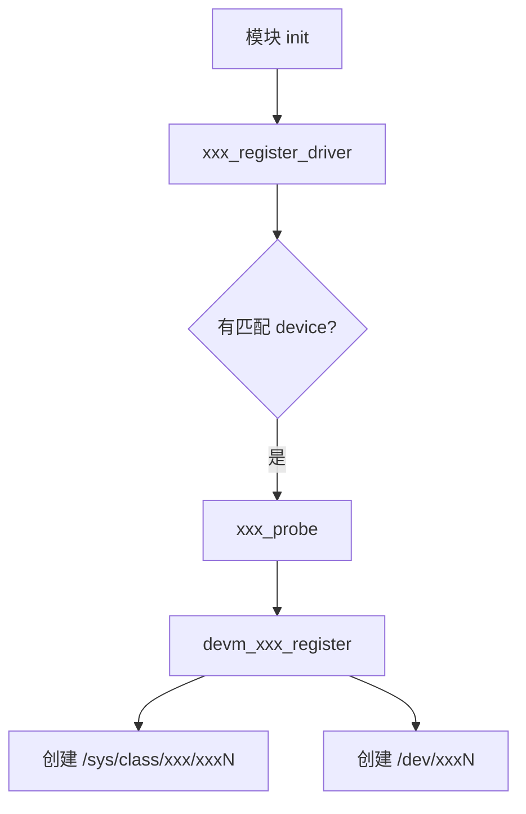

# {子系统名} / framework

> 这个子系统的"15 分钟全景"。看完应该能向同事讲清楚它干啥、有哪些核心结构体、典型注册流程。

## 一句话

{子系统名} 子系统负责 {做什么}，对外提供 {什么接口}，对内抽象 {什么硬件}。

## 内核里的位置

```text
drivers/{subsys}/
├── {subsys}.c       核心框架
├── {subsys}-core.c  公共逻辑
├── drivers/         具体硬件驱动
└── ...
```

## 核心结构体

| 结构体 | 角色 | 文件 |
|--------|------|------|
| `struct xxx_dev` | 一个设备实例 | `include/linux/xxx.h` |
| `struct xxx_ops` | driver 提供的回调 | `include/linux/xxx.h` |
| `struct xxx_chip` | hardware 抽象 | `include/linux/xxx.h` |

## 典型注册流程



## 用户态接口

| 接口 | 路径 | 用途 |
|------|------|------|
| sysfs | `/sys/class/xxx/xxxN/` | 配置、状态 |
| chardev | `/dev/xxxN` | 数据 |
| ioctl | `/dev/xxxN` + `XXX_IO_CMD` | 控制 |
| netlink | - | 异步事件 |

## 与其他子系统的关系

| 上游 / 下游 | 子系统 | 怎么交互 |
|-----------|--------|---------|
| 依赖 | clk | devm_clk_get |
| 依赖 | regulator | devm_regulator_get |
| 提供给 | userspace | sysfs / chardev |
| 配合 | dma-buf | 共享 buffer |

## RK3568 / QCS6490 上的具体实现

| 平台 | 驱动文件 | 特点 |
|------|---------|------|
| RK3568 mainline | `drivers/{subsys}/xxx-rockchip.c` | mainline 干净 |
| RK3568 BSP | `develop-6.1/drivers/{subsys}/xxx-rockchip.c` | vendor 加 quirk |
| QCS6490 | `drivers/{subsys}/xxx-qcom.c` | Qualcomm 风格 |

## 必读资料

- 内核 Documentation: `Documentation/{subsys}/`
- LWN 系列：
- 关键 commit：

## AI 端侧相关性

{为什么这个子系统对端侧 AI 重要 / 不重要}
